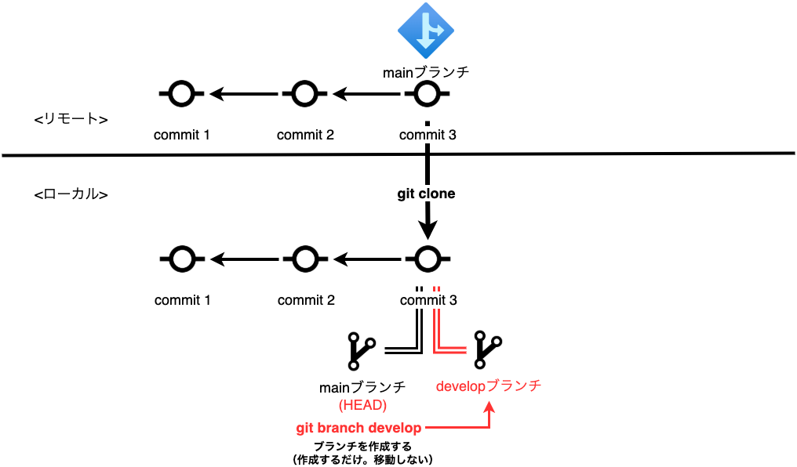
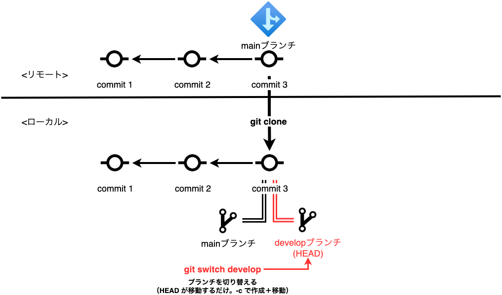
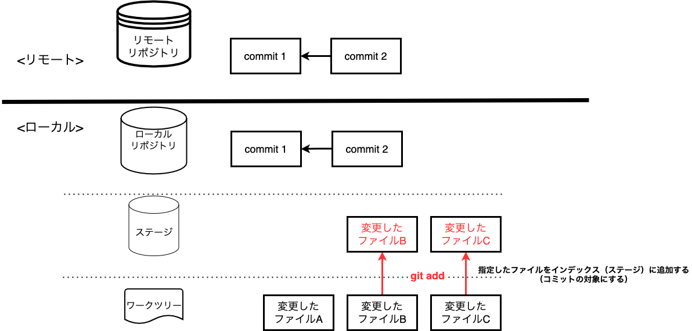
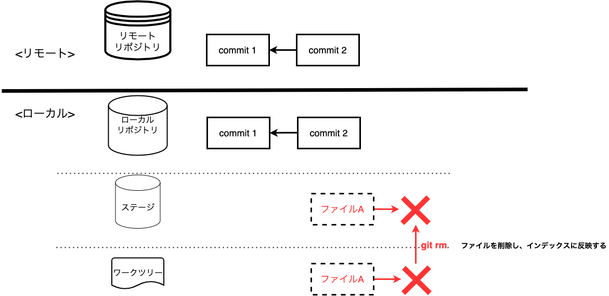

# Git 勉強会 2 日目 <!-- omit in toc -->

基本コマンド ＆ ハンズオン ① 　〜個人開発編〜
2022/03/25

---

## 本日のゴール <!-- omit in toc -->

### 頭の中に「こんなときはこうする」というインデックスをぼんやりと作ること <!-- omit in toc -->

- Git の各サブコマンドの存在を知ること
- 各サブコマンドのユースケースを知り、Git で躓いたときに本資料を見返そうと思い付けること

**→ この資料は辞書として使っていってほしいので、完全に理解しようとしないで OK です！**

---

- [コマンド説明（★ 付きコマンドのみ当日説明します）](#コマンド説明-付きコマンドのみ当日説明します)
  - [clone ★](#clone-)
  - [config ★](#config-)
  - [init](#init)
  - [remote](#remote)
  - [branch ★](#branch-)
  - [switch (checkout) ★](#switch-checkout-)
  - [status ★](#status-)
  - [add ★](#add-)
  - [commit ★](#commit-)
  - [push ★](#push-)
  - [mv](#mv)
  - [rm](#rm)
  - [log ★](#log-)
  - [diff](#diff)
- [ハンズオン](#ハンズオン)
  - [【参考】ターミナルでよく使うコマンド ①](#参考ターミナルでよく使うコマンド-)
  - [【参考】ターミナルでよく使うコマンド ②](#参考ターミナルでよく使うコマンド--1)
  - [ハンズオン ①：既にリモートに存在するリポジトリをコピー](#ハンズオン-既にリモートに存在するリポジトリをコピー)
  - [ハンズオン ②：Git 開始時の基本設定](#ハンズオン-git-開始時の基本設定)
  - [ハンズオン ③：ブランチの作成・移動・名前変更・削除](#ハンズオン-ブランチの作成移動名前変更削除)
  - [ハンズオン ④：変更をステージに追加](#ハンズオン-変更をステージに追加)
  - [ハンズオン ⑤：変更を記録してリモートリポジトリへ送信](#ハンズオン-変更を記録してリモートリポジトリへ送信)

---

## コマンド説明（★ 付きコマンドのみ当日説明します）

---

### スライドの基本構成 <!-- omit in toc -->

---

### Git サブコマンド名（ex. clone） <!-- omit in toc -->

#### 機能 <!-- omit in toc -->

- コマンドの役割・機能の説明

#### ユースケース <!-- omit in toc -->

- どんなときに使うか（逆引き用）

#### イメージ <!-- omit in toc -->

- 内部構造を理解するため図で説明

---

#### 主なオプション <!-- omit in toc -->

- よく使うオプション

#### コマンド例 <!-- omit in toc -->

- よく使うコマンドの例

#### 備考 <!-- omit in toc -->

- 注意点等（あれば）

#### 参考 <!-- omit in toc -->

- 公式リファレンス + 分かりやすい記事 （理解を深めたい人へのおすすめ記事）

---

### clone ★

#### 機能 <!-- omit in toc -->

- リモートリポジトリの複製をローカルに作成する

#### ユースケース <!-- omit in toc -->

- 既に存在するリモートリポジトリ（GitHub/GitLab）のソースコードをローカルに複製したい

---

#### イメージ <!-- omit in toc -->


---

#### 主なオプション <!-- omit in toc -->

- `-b | --branch`: 複製したいブランチを指定する

#### コマンド例 <!-- omit in toc -->

```bash
$ git clone <リモートリポジトリの URL>  # リモートリポジトリをローカルに複製
$ git clone <リモートリポジトリの URL> -b <ブランチ>   # ブランチを指定してリモートリポジトリをローカルに複製
$ git clone <変更後のディレクトリ名>  # リモートリポジトリをローカルに複製し、ディレクトリ名を変更
$ git clone .  # 現在いるディレクトリをルートディレクトリとして複製（git clone でディレクトリを作成しない）
```

#### 備考 <!-- omit in toc -->

- git clone をした場合は git init は不要
  - 複製して生成されたローカルリポジトリには既に .git ディレクトリが存在する

#### 参考 <!-- omit in toc -->

- [git-clone – Git コマンドリファレンス（日本語版）]()
- [git clone でディレクトリを作らない](https://orfool.com/programing/git-clone-without-dir/)

---

### config ★

#### 機能 <!-- omit in toc -->

- 現在の Git の設定を取得、変更する

#### ユースケース <!-- omit in toc -->

- git を利用し始める際に、ユーザー名やメールアドレス等を設定したい
- プロジェクトごとに複数の git アカウントを使い分けたい
- 現在の Git の設定がどうなっているのかを確認したい

---

#### コマンド例 <!-- omit in toc -->

```bash
$ git config  # 現在いるリポジトリの Git 設定を表示
$ git config --global user.name "<メインアカウントのユーザー名>" # デフォルトのユーザー名を設定
$ git config --global user.email "<メインアカウントのメールアドレス>"  # デフォルトのメールアドレスを設定
$ git config --global core.editor 'code --wait' # メインエディタを　Visual Studio Code (code) に設定。`--wait` はエディタを終了するまでプログラムの実行を待つというオプション。

$ cd /path/to/repository # 特定のプロジェクトのローカルリポジトリへ移動
$ git config --local user.name "<サブアカウントのユーザー名>" # 特定リポジトリのユーザー名を設定
$ git config --local user.email "<サブアカウントのメールアドレス>" # 特定リポジトリのメールアドレスを設定
$ git config --local --list # ローカルの設定一覧を表示。`--global` にすると全体のデフォルト設定を表示
$ git config --local user.name  # ローカル設定のユーザー名を表示
```

#### 備考 <!-- omit in toc -->

- `/path/to/repository` の箇所はユーザーごとにパスが異なるので、そのままコピペしないように注意
- `--global` の設定ファイルは `~/.gitconfig` にある
- `--local` の設定ファイルは `/path/to/repository/.git/config` にある

#### 参考 <!-- omit in toc -->

- [git-config Documentation](https://git-scm.com/docs/git-config)
- [Git をインストールしたら真っ先にやっておくべき初期設定 - Qiita](https://qiita.com/wnoguchi/items/f7358a227dfe2640cce3)
- [複数の git アカウントを使い分ける - Qiita](https://qiita.com/0084ken/items/f4a8b0fbff135a987fea)

---

### init

#### 機能 <!-- omit in toc -->

- Git ローカルリポジトリを作成する
  - `.git` ディレクトリ（フォルダ）が作成される

#### ユースケース <!-- omit in toc -->

- Git でバージョン管理を始めたい

---

#### イメージ <!-- omit in toc -->


---

#### コマンド例 <!-- omit in toc -->

```bash
$ cd /path/to/repository # 特定のプロジェクトのルートディレクトリへ移動
$ git init  # git でバージョン管理を開始
```

#### 備考 <!-- omit in toc -->

- git clone をした場合は git init は不要
  - 複製して生成されたローカルリポジトリには既に .git ディレクトリが存在する
- `/path/to/repository` の箇所はユーザーごとにパスが異なるので、そのままコピペしないように注意
- .git ディレクトリにはリポジトリを Git でバージョン管理するために必要なすべてのファイル (Git リポジトリのスケルトン) が格納されている
  - 中身の詳細については [.git ディレクトリの中身を見てみる 👀 - Qiita](https://qiita.com/tatane616/items/dbad66179754be57d2e2) を参照

#### 参考 <!-- omit in toc -->

- [git-init – Git コマンドリファレンス（日本語版）](https://tracpath.com/docs/git-init/)
- [Git リポジトリの取得 – Git コマンドリファレンス（日本語版）](https://git-scm.com/book/ja/v2/Git-%E3%81%AE%E5%9F%BA%E6%9C%AC-Git-%E3%83%AA%E3%83%9D%E3%82%B8%E3%83%88%E3%83%AA%E3%81%AE%E5%8F%96%E5%BE%97)
- [.git ディレクトリの中身を見てみる 👀 - Qiita](https://qiita.com/tatane616/items/dbad66179754be57d2e2)

---

### remote

#### 機能 <!-- omit in toc -->

- リモートリポジトリの関連付けの設定を管理する

#### ユースケース <!-- omit in toc -->

- リモートリポジトリ（GitHub / GitLab）を登録（削除）したい
- リモートリポジトリの名前と場所（URL）を確認したい
  - Fork したリポジトリなど、リモートリポジトリが複数ある場合に便利

---

#### イメージ <!-- omit in toc -->


---

#### 主なオプション <!-- omit in toc -->

- `-v | --verbose`: 詳細を表示

#### コマンド例 <!-- omit in toc -->

```bash
$ git remote add origin <リモートリポジトリのURL> # 指定したリモートリポジトリを origin という名前で管理（関連付け）する
$ git remote -v # 関連付け設定されているリモートリポジトリとその詳細を一覧表示する
$ git remote remove <リモートリポジトリのURL> # リモートリポジトリの関連付け設定を削除する
```

#### 参考 <!-- omit in toc -->

- [git-remote Documentation](https://git-scm.com/docs/git-remote)
- [【 git remote 】コマンド（基礎編）――リモートリポジトリを追加、削除する](https://atmarkit.itmedia.co.jp/ait/articles/2005/08/news017.html)

---

### branch ★

#### 機能 <!-- omit in toc -->

- ブランチを作成、削除、一覧表示する

#### ユースケース <!-- omit in toc -->

- ローカルリポジトリにブランチを作成したい
- ローカルリポジトリにあるブランチを確認したい
- ローカルリポジトリにあるブランチの名前を変えたい
- ローカルリポジトリにあるブランチを削除したい

---

#### イメージ <!-- omit in toc -->



---

#### 主なオプション <!-- omit in toc -->

- `-a | --all`: リモート追跡ブランチを含んだブランチの一覧を表示
- `-m | --move`: 現在チェックアウトしているブランチ名を指定したブランチ名で変更（`-M` で強制変更）
  - 指定したブランチ名が既に存在する場合はエラーとなり変更できない
  - その場合はいずれかのブランチ名を変更するか、`-M` で上書きによる強制変更
- `-d | --delete`: 指定したブランチを削除（`-D` で強制削除）
  - 指定したブランチに push していないコミットが残っている場合はエラーとなり削除できない
  - その場合は push するか、`-D` で強制削除

#### コマンド例 <!-- omit in toc -->

```bash
$ git fetch # リモートリポジトリの最新情報を取得
$ git branch -a # ローカルとリモートにあるブランチ（リモート追跡ブランチ）一覧を表示。`remotes/origin/<ブランチ>` で表示されるブランチがリモート追跡ブランチ
$ git branch <ブランチ名> # ブランチを作成
$ git branch -m <変更後のブランチ名>  # 今いるブランチ名を変更
$ git branch -d <ブランチ名>  # 指定したブランチを削除。-D で強制削除
```

#### 参考 <!-- omit in toc -->

- [git-branch – Git コマンドリファレンス（日本語版）](https://tracpath.com/docs/git-branch/)
- [git branch コマンド - Qiita](https://qiita.com/chihiro/items/e178e45a7fd5a2fb4599)
- [[Git]git branch コマンドの -m と -M オプションの違い](https://www.curict.com/item/58/58909e5.html)

---

### switch (checkout) ★

#### 機能 <!-- omit in toc -->

- ワークツリーを異なるブランチに切り替える

#### ユースケース <!-- omit in toc -->

- 既に存在するブランチに移動したい
- 新しいブランチを作成したい（そのまま移動したい）

---

#### イメージ <!-- omit in toc -->



---

#### 主なオプション <!-- omit in toc -->

- `-c | --create`: ブランチを新規作成して切り替え

#### コマンド例 <!-- omit in toc -->

```bash
$ git switch <ブランチ>  # <ブランチ>  で指定したブランチに移動する。git checkout <ブランチ> と同じ
$ git switch -c <ブランチ>  # <ブランチ>  で指定したブランチを新規作成して、移動する。git checkout -b <ブランチ> と同じ
```

#### 備考 <!-- omit in toc -->

- switch は Git バージョン 2.23.0 でリリース (2019/08/16)
- checkout は複数の役割を兼ね備えてしまっているため、こちらの方が直感的に理解しやすい

#### 参考 <!-- omit in toc -->

- [git-switch – Git コマンドリファレンス（日本語版）](https://tracpath.com/docs/git-switch/)
- [git checkout の代替としてリリースされた git switch と git restore](https://kakakakakku.hatenablog.com/entry/2020/04/08/151627)

---

### status ★

#### 機能 <!-- omit in toc -->

- ワークツリーにあるファイルの状態を表示する

#### ユースケース <!-- omit in toc -->

- どのファイルを変更したのか、add, commit 済かどうかを知りたい
- コンフリクトしたのでどうすればいいか知りたい
- よく分からないけどエラーになったから対処方法を知りたい

---

#### 主なオプション <!-- omit in toc -->

- `-s | --short`: 短い形式で表示

#### コマンド例 <!-- omit in toc -->

```bash
$ git status
$ git status -s
```

#### 参考 <!-- omit in toc -->

- [git-status – Git コマンドリファレンス（日本語版）](https://tracpath.com/docs/git-status/)
- [git status -s でちょっと幸せになれる - Qiita](https://qiita.com/tommy_aka_jps/items/af536a7c20747f99aa42)

---

### add ★

#### 機能 <!-- omit in toc -->

- ファイルをインデックスに追加（ステージング）する（コミットの対象にする）

#### ユースケース <!-- omit in toc -->

- 修正を入れた複数のファイルのうち、一部をコミット対象（インデックスに追加）したい
- 修正を入れた全てのファイルをコミット対象（インデックスに追加）したい
- コンフリクトを解決したファイルをコンフリクト解決済の状態に変更したい

---

#### イメージ <!-- omit in toc -->



---

#### 主なオプション <!-- omit in toc -->

- `-p | --patch`: ファイル内の任意の変更行のみインデックスに追加

#### コマンド例 <!-- omit in toc -->

```bash
$ git add ./src/index.html  # ./src/index.html のみインデックスに追加
$ git add ./src/  # ./src ディレクトリ以下の全てのファイルをインデックスに追加
$ git add .  # 変更済の全てのファイルをインデックスに追加
$ git add *.java  # *（ワイルドカード）で特定の文字列にマッチするファイルをインデックスに追加（この場合は .java ファイル）
$ git add -p ./src/index.html  # ./src/index.html の一部の変更行をインデックスに追加（インタラクティブモードで選択する）
```

#### 備考 <!-- omit in toc -->

- `add -p` による部分ステージングは Visual Studio Code などのエディタ機能を使ってやるのがおすすめ

#### 参考 <!-- omit in toc -->

- [git-add – Git コマンドリファレンス（日本語版）](https://tracpath.com/docs/git-add/)
- [【 git add 】コマンド――変更内容をインデックスに追加してコミット対象にする](https://atmarkit.itmedia.co.jp/ait/articles/2003/13/news031.html)
- [git add -p 使ってますか？](https://qiita.com/cotton_desu/items/bf08ac57d59b37dd5188)
- [VSCode で git add -p を快適に行う](https://qiita.com/shotana/items/3690d1c913fc0d8fdb4d)

---

### commit ★

#### 機能 <!-- omit in toc -->

- インデックスに追加した変更をローカルリポジトリに記録する

#### ユースケース <!-- omit in toc -->

- 変更した内容を記録（コミット）したい
- 直前のコミットメッセージを修正したい

---

#### イメージ <!-- omit in toc -->


---

#### 主なオプション <!-- omit in toc -->

- `-m | --message`: コミットと同時にコミットメッセージを記録する

#### コマンド例 <!-- omit in toc -->

```bash
$ git commit
$ git commit -m "<メッセージ>"
$ git commit --amend -m "<修正後のメッセージ>"
```

#### 備考 <!-- omit in toc -->

- 2 つ以上前のコミットを修正したい場合は `git rebase -i` を利用する

#### 参考 <!-- omit in toc -->

- [git-commit – Git コマンドリファレンス（日本語版）](https://tracpath.com/docs/git-commit/)
- [コミットの修正には git commit --amend が便利](https://tech-blog.rakus.co.jp/entry/20191113/git)

---

### push ★

#### 機能 <!-- omit in toc -->

- ローカルリポジトリの変更内容をリモートリポジトリに送信する

#### ユースケース <!-- omit in toc -->

- ローカルリポジトリに記録した内容をリモートリポジトリに反映したい

---

#### イメージ <!-- omit in toc -->


---

#### 主なオプション <!-- omit in toc -->

- `-u | --set-upstream`: 上流ブランチを設定
- `-f | --force`: プッシュを強制 **（できるだけ使わない！）**
- `--force-with-lease`: プッシュを強制 **（リモートと比較してローカルが最新のときだけ成功する）**
- `-d | --delete`: リモートリポジトリのブランチを削除

#### コマンド例 <!-- omit in toc -->

```bash
$ git push -u origin <ブランチ名>  # 上流ブランチを設定
$ git push origin <ブランチ名>  # 上流ブランチが設定されている状態なら git push でも可
$ git push --force-with-lease origin <ブランチ名> # 強制プッシュ
$ git push --delete origin <ブランチ名> # 指定したリモートリポジトリのブランチを削除。git push origin :<ブランチ名> でも可
```

#### 備考 <!-- omit in toc -->

- 極力強制プッシュが極力発生しない運用にする。リモートリポジトリのブランチ設定で意図せぬ削除から保護する
  - どうしてもプッシュしないといけない場合はチームメンバーに確認したうえで `--force-with-lease` を使う

#### 参考 <!-- omit in toc -->

- [git-push – Git コマンドリファレンス（日本語版）](https://tracpath.com/docs/git-push/)
- [git push コマンドの使い方と、主要オプションまとめ](https://www-creators.com/archives/1472)
- [Git 用語：上流ブランチとは？](https://www-creators.com/archives/4931)
- [git push -f をやめて --force-with-lease を使おう - Qiita](https://qiita.com/wMETAw/items/5f47dcc7cf57af8e449f)

---

### mv

#### 機能 <!-- omit in toc -->

- ファイルやディレクトリの名前を変更し、インデックスに反映する (move)

#### ユースケース <!-- omit in toc -->

- Git 管理しているファイルの名前を変更したい

---

#### イメージ <!-- omit in toc -->


---

#### コマンド例 <!-- omit in toc -->

```bash
$ git mv <変更前のファイル名> <変更後のファイル名>  # ファイル名を変更し、インデックスに反映
```

#### 備考 <!-- omit in toc -->

- mv コマンドでファイル名を変更しても、その後 git add, git rm をすれば同じ挙動になる

```bash
# git mv ではなく mv でファイル名変更をしてしまっても
$ mv <変更前のファイル名> <変更後のファイル名>

# 以下のコマンドを実行すればファイル移動したことをインデックスにも反映できる（結果的に git mv と同じ操作になる）
$ git add <変更後のファイル名>
$ git rm <変更前のファイル名>
```

#### 参考 <!-- omit in toc -->

- [git-mv – Git コマンドリファレンス（日本語版）](https://tracpath.com/docs/git-mv/)
- [Git で管理しているファイルのリネームを git mv でなく mv してしまったときにどうなるのか調べてみた - Qiita](https://qiita.com/zonkyy/items/7705844c5e255b8fa3ae)

---

### rm

#### 機能 <!-- omit in toc -->

- ファイルを削除し、インデックスに反映する (remove)

#### ユースケース <!-- omit in toc -->

- Git 管理しているファイルを削除したい
- `.gitignore` ファイルを編集したけど反映されない

---

#### イメージ <!-- omit in toc -->



---

#### 主なオプション <!-- omit in toc -->

- `-r`: 先頭のディレクトリが指定されている場合、ディレクトリ以下にあるファイルも再帰的に削除
- `--cached`: インデックスからのみ削除（ワークツリーにあるファイル自体は削除されず、Git 管理のみ止める）

#### コマンド例 <!-- omit in toc -->

```bash
$ git rm <ファイル名> # 指定したファイルを削除（Git 管理も止める）
$ git rm -r --cached .  # ファイル全体キャッシュ削除
```

#### 備考 <!-- omit in toc -->

- rm コマンドでファイル名を変更しても、その後 git add をすれば同じ挙動になる

```bash
# git rm ではなく rm でファイル削除をしてしまっても
$ rm <ファイル名>

# 以下のコマンドを実行すればファイル削除したことをインデックスにも反映できる（結果的に git rm と同じ操作になる）
$ git add <ファイル名>
```

#### 参考 <!-- omit in toc -->

- [git-rm – Git コマンドリファレンス（日本語版）](https://tracpath.com/docs/git-rm/)
- [【Git 初心者入門】いちいちステージングエリアに add しなくても削除できる git rm](https://hirocorpblog.com/git-rm/)
- [.gitignore に記載したのに反映されない件 - Qiita](https://qiita.com/fuwamaki/items/3ed021163e50beab7154)

---

### log ★

#### 機能 <!-- omit in toc -->

- コミット時のログを表示する

#### ユースケース <!-- omit in toc -->

- コミット履歴を確認したい
  - 自分のコミットが成功したか確認したい
  - 他の人がこのブランチでどのようなコミットをしてきたのか知りたい

---

#### 主なオプション <!-- omit in toc -->

- `--oneline`: 各コミットのログを 1 行で表示
- `--no-merges`: マージコミットを除いて表示

#### コマンド例 <!-- omit in toc -->

```bash
$ git log
$ git log --oneline
# 以下は応用例（エイリアスに登録しておくと便利）
$ git log --graph --pretty=format:'%x09%C(auto) %h %Cgreen %ar %Creset%x09by"%C(cyan ul)%an%Creset" %x09%C(auto)%s %d'
```

#### 備考 <!-- omit in toc -->

- GitHub や Visual Studio Code の拡張機能を使う方が log が見やすいのでおすすめ（以下の参考記事を参照）

#### 参考 <!-- omit in toc -->

- [git-log – Git コマンドリファレンス（日本語版）](https://tracpath.com/docs/git-log/)
- [git log よく使うオプションまとめ - Qiita](https://qiita.com/take4s5i/items/15d8648405f4e7ea3039)
- [git log のオプションと綺麗にツリー表示するためのエイリアス - Qiita](https://qiita.com/kawasaki_dev/items/41afaafe477b877b5b73)
- [GitHub 上（ブラウザ上）でコミット履歴を確認する方法](https://chico-shikaku.com/2019/08/github-commit-log/)

---

### diff

#### 機能 <!-- omit in toc -->

- コミット同士やコミットとワークツリーの内容を比較する

#### ユースケース <!-- omit in toc -->

- push する前にリモートリポジトリとの変更点を確認したい
- コミット同士を比較したい
- ブランチ間の差分を比較したい

---

#### イメージ <!-- omit in toc -->


---

#### 主なオプション <!-- omit in toc -->

- `--cached | --staged`: インデックスとローカルリポジトリを比較

#### コマンド例 <!-- omit in toc -->

```bash
$ git diff # git add する前に変更点の比較
$ git diff --cached # git commit する前に変更点の比較
$ git diff HEAD^ # 直前のコミットの差分を表示
$ git diff リモート名/ブランチ名..HEAD # git push する前にリモートとの変更点の比較
$ git diff <変更前のコミットID>..<変更後のコミットID> # コミット同士の比較（コミットIDは git log で調べる）
$ git diff <ブランチA>..<ブランチ名B> # ブランチ同士の比較
$ git diff -- <ファイルパスA> <ファイルパスB> # 別ファイル同士の比較（-- の後はパスとして認識される）
```

#### 備考 <!-- omit in toc -->

- GitHub や Visual Studio Code の拡張機能を使う方が diff が見やすいのでおすすめ（以下の参考記事を参照）

#### 参考 <!-- omit in toc -->

- [git-diff – Git コマンドリファレンス（日本語版）](https://tracpath.com/docs/git-diff/)
- [忘れやすい人のための git diff チートシート](https://qiita.com/shibukk/items/8c9362a5bd399b9c56be)
- [【やっとわかった！】git の HEAD^と HEAD~の違い - Qiita](https://qiita.com/chihiro/items/d551c14cb9764454e0b9)
- [github でブランチ・commit 間の diff を見る - Qiita](https://qiita.com/fantasista_21jp/items/9419ca4ab3bb8e1ee4c5)
- [vscode で git の異なる branch 間の差分を確認する方法 - Qiita](https://qiita.com/nabenabe0928/items/9f36ee4fe1af92c215f6)

---

## ハンズオン

### 事前準備 <!-- omit in toc -->

以下が終わっていない人は実施をお願いします。

1. ローカル端末 Git（`v2.23.0` 以上推奨） をインストールしておいてください。（ターミナルで `git --version` を実行して `v2.23.0` 以上が表示されれば OK です）
   1. 【参考】[Git インストール手順＜ Windows 向け＞](https://sukkiri.jp/technologies/devtools/git/git_win.html)
   2. 【参考】[Git Bash を手動でアップデートする方法【Git for Windows】](https://onoredekaiketsu.com/manually-update-git-bash/)
2. ハンズオン用に GitHub や GitLab で個人用のリモートリポジトリを作成しておいてください。
   1. 【参考】 [GitLab での個人リポジトリの作成方法（From 赤池さん）](https://works-hi.slack.com/archives/CNJKVLCS0/p1646982929353649?thread_ts=1646974757.179429&cid=CNJKVLCS0)
   2. 【参考】[【GitLab】プロジェクト（リポジトリ）を作成する - Qiita](https://qiita.com/CUTBOSS/items/ce61bb6a8635c6918558)
   3. 【参考】[【超入門】GitHub リポジトリの作り方 - Qiita](https://qiita.com/ucan-lab/items/d594404d0d2c64a85a38)

**利用するコマンドの説明スライドを復習しながら進めましょう！**

---

### 【参考】ターミナルでよく使うコマンド ①

#### cd <!-- omit in toc -->

- ディレクトリを移動します。

#### ls <!-- omit in toc -->

- ディレクトリの内容を表示します。 ls -a コマンドで、隠しファイルを含めたディレクトリ全内容を表示します。

#### mkdir <!-- omit in toc -->

- ディレクトリを新規作成します。

#### touch <!-- omit in toc -->

- ファイルを作成します

#### rm <!-- omit in toc -->

- ファイルを削除します。

---

### 【参考】ターミナルでよく使うコマンド ②

#### cp <!-- omit in toc -->

- ファイルをコピーします。

#### mv <!-- omit in toc -->

- ファイルの移動とファイル名の変更を行います。

#### cat <!-- omit in toc -->

- ファイルの中身を表示します。

#### echo <!-- omit in toc -->

- 画面に文字列を表示します。

#### >> **（リダイレクト（追記））** <!-- omit in toc -->

- コマンドの出力結果をファイルへ追記します。
  - `echo` コマンドと組み合わせて、`echo "文字列" >> ファイル名` で指定した文字列をファイルに追記します。

---

### ハンズオン ①：既にリモートに存在するリポジトリをコピー

リモートリポジトリをローカルに複製してみましょう
（次頁に解答例があります）

#### 操作手順例 <!-- omit in toc -->

1. 自身のプロジェクト置き場（リモートリポジトリを複製する場所）へ移動
2. リモートリポジトリをローカルに複製
   1. 事前準備で用意した個人リモートリポジトリがない場合は、以下の本勉強会用のリモートリポジトリを複製してください
      1. `git@github.com:irongineer/git-exercise.git`
3. リモートリポジトリがローカルに複製されていることを確認
4. 複製してきたリポジトリに .git ディレクトリがあることを確認

---

### ハンズオン ①：既にリモートに存在するリポジトリをコピー（解答例） <!-- omit in toc -->

```bash
$ cd workspace # 自身のプロジェクト置き場（リモートリポジトリを複製する場所）へ移動（※ workspace は例です）
$ git clone git@github.com:irongineer/git-exercise.git  # リモートリポジトリをローカルに複製（※ git-exercise は例です）
$ ls -a # リモートリポジトリがローカルに複製されていることを確認
$ ls -a　git-exercise # 複製してきたリポジトリに .git ディレクトリがあることを確認（※ git-exercise は例です）
```

---

### ハンズオン ②：Git 開始時の基本設定

自身のプロジェクトで Git のローカル設定を行ってみましょう
（次頁に解答例があります）

#### 操作手順例 <!-- omit in toc -->

1. 自身のプロジェクトのルートディレクトリへ移動
2. ローカルリポジトリのユーザー名を設定
3. ローカルリポジトリのメールアドレスを設定
4. メインエディタを　 Visual Studio Code (code) に設定。他のエディタでも OK（vim など）
5. 上記設定を確認

---

### ハンズオン ②：Git 開始時の基本設定（解答例） <!-- omit in toc -->

```bash
$ cd git-exercise # ハンズオン用ディレクトリへ移動（※ git-exercise は例です）
$ git config --local user.name "<メインアカウントのユーザー名>" # ローカルリポジトリのユーザー名を設定
$ git config --local user.email "<メインアカウントのメールアドレス>"  # ローカルリポジトリのメールアドレスを設定
$ git config --local core.editor 'code --wait' # メインエディタを　Visual Studio Code (code) に設定。他のエディタでも OK（vim など）

# 設定の確認
$ git config --local --list # ローカルの設定一覧を表示
$ git config user.name # ローカルの個別設定を表示（ユーザー名）
$ git config user.email # ローカルの個別設定を表示（メールアドレス）
$ git config core.editor  # ローカルの個別設定を表示（メインエディタ）
$ cat .git/config  # local の設定ファイルを確認（global の設定ファイルは ~/.gitconfig）
```

---

### ハンズオン ③：ブランチの作成・移動・名前変更・削除

ローカルリポジトリにブランチを作成し、移動や名前変更などを行ってみましょう
（次頁に解答例があります）
**なお、ハンズオン ① で本勉強会用のリモートリポジトリを複製している場合は、他の人との重複防止のため、作成するすべてのブランチ名に `-<社員番号>` を付けてください (ex: develop-1234)**

#### 操作手順例 <!-- omit in toc -->

1. ハンズオン用ディレクトリへ移動
2. develop ブランチを作成
3. develop ブランチに切り替え
4. temp ブランチを作成して切り替え
5. temp ブランチを temp2 ブランチに名前変更
6. リモートリポジトリの最新情報をローカルに取得
7. ローカルとリモートリポジトリにあるブランチ（リモート追跡ブランチ）一覧を確認
8. develop ブランチへ切り替え
9. temp2 ブランチを削除

---

### ハンズオン ③：ブランチの作成・移動・名前変更・削除（解答例） <!-- omit in toc -->

```bash
$ cd git-exercise # ハンズオン用ディレクトリへ移動（※ git-exercise は例です）
$ git branch develop # develop ブランチを作成
$ git switch develop # develop ブランチに切り替え。git checkout develop でも可
$ git switch -c temp # temp ブランチを作成して切り替え。git checkout -b temp でも可
$ git branch -m temp2 # temp ブランチを temp2 ブランチに名前変更。`-M` の場合は同名のブランチがあっても上書きで強制変更
$ git fetch # リモートリポジトリの最新情報をローカルに取得
$ git branch -a # ローカルとリモートリポジトリにあるブランチ（リモート追跡ブランチ）一覧を確認（エディタで vim が開いた場合は `:q` で終了）
$ git switch develop # develop ブランチへ切り替え
$ git branch -d temp2 # temp2 ブランチを削除
```

---

### ハンズオン ④：変更をステージに追加

ファイルを変更し、ステージに追加してみましょう
（次頁に解答例があります）

#### 操作手順例 <!-- omit in toc -->

1. ハンズオン用ディレクトリへ移動
2. develop ブランチへ切り替え
3. index.html ファイルを作成
4. 任意のエディタでリポジトリを開く
5. index.html に `<h1>develop での変更</h1>` と追記
6. 状態を確認
   1. `Untracked files: index.html` と表示される
7. ワークツリーとインデックスの差分を比較
   1. 差分が表示されない **（新規ファイル作成ではない（既に add 済で追跡対象であるファイルの）場合は差分が表示される）**
8. ワークツリーの全ての変更ファイルをインデックスに追加
9. 状態を確認
   1. `Changes to be committed: new file: index.html` と表示される
10. インデックスとローカルリポジトリの差分を比較
    1. 差分が表示される

---

### ハンズオン ④：変更をステージに追加（解答例） <!-- omit in toc -->

```bash
$ cd git-exercise # ハンズオン用ディレクトリへ移動（※ git-exercise は例です）
$ git switch develop  # develop ブランチへ切り替え
$ touch index.html  # index.html ファイルを作成
$ code . # 任意のエディタでリポジトリを開く（解答例は Visual Studio Code を使用）

（index.html に「<h1>develop での変更</h1>」と追記）# エディタを開かずに echo "<h1>develop での変更</h1>" >> index.html を実行しても OK

$ git status # 状態を確認。Untracked files: index.html と表示される
$ git diff  # ワークツリーとインデックスの差分を比較。差分が表示されない（新規ファイル作成ではない（既に add 済で追跡対象であるファイルの）場合は差分が表示される）（エディタで vim が開いた場合は `:q` で終了）

$ git add . # ワークツリーの全ての変更ファイルをインデックスに追加
$ git status  # 状態を確認。Changes to be committed: new file: index.html と表示される
$ git diff --cached # インデックスとローカルリポジトリの差分を比較。差分が表示される。git diff --staged でも OK（エディタで vim が開いた場合は `:q` で終了）
```

---

### ハンズオン ⑤：変更を記録してリモートリポジトリへ送信

ハンズオン ④ で変更したファイルをローカルリポジトリに記録し、リモートリポジトリに送信してみましょう
（次頁に解答例があります）

#### 操作手順例 <!-- omit in toc -->

0. （ハンズオン ④ の続きから）
1. 変更をローカルリポジトリに記録
2. 状態を確認
   1. `Your branch is ahead of 'origin/<ブランチ名>' by 1 commit. nothing to commit, working tree clean` と表示される
3. 変更履歴を確認
4. 記録した変更をリモートリポジトリに送信
5. 状態を確認
   1. `Your branch is up to date with 'origin/<ブランチ名>'. nothing to commit, working tree clean` と表示される
6. リモートリポジトリ（GitHub / GitLab）にアクセスし、該当ブランチに変更が反映されていることを確認

---

### ハンズオン ⑤：変更を記録してリモートリポジトリへ送信（解答例） <!-- omit in toc -->

```bash
$ git commit -m "develop を追記"  # 変更をローカルリポジトリに記録
$ git status  # 状態を確認。Your branch is ahead of 'origin/<ブランチ名>' by 1 commit. nothing to commit, working tree clean と表示される
$ git log # 変更履歴を確認（エディタで vim が開いた場合は `:q` で終了）
$ git push origin develop  # 記録した変更をリモートリポジトリに送信。既に上流ブランチを現在チェックアウトしているブランチに設定している場合は省略可
$ git status  # 状態を確認。Your branch is up to date with 'origin/<ブランチ名>'. nothing to commit, working tree clean と表示される

# （リモートリポジトリ（GitHub / GitLab）にアクセスし、該当ブランチに変更が反映されていることを確認）
```

---

## 本日のゴール（再掲） <!-- omit in toc -->

### 頭の中に「こんなときはこうする」というインデックスをぼんやりと作ること <!-- omit in toc -->

- Git の各サブコマンドの存在を知ること
- 各サブコマンドのユースケースを知り、Git で躓いたときに本資料を見返そうと思い付けること

**→ この資料は辞書として使っていってほしいので、完全に理解しようとしないで OK です！**

---

## 次回 <!-- omit in toc -->

次回は **基本コマンド ＆ ハンズオン ② 　〜チーム開発編〜** です！
おたのしみに！
