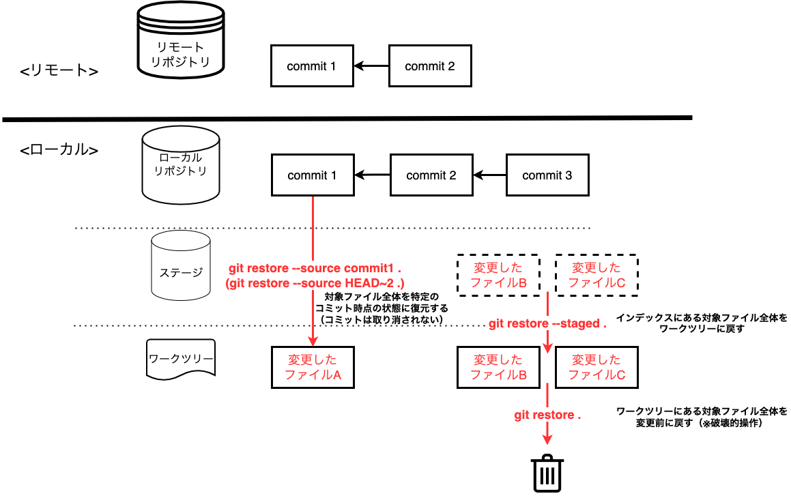
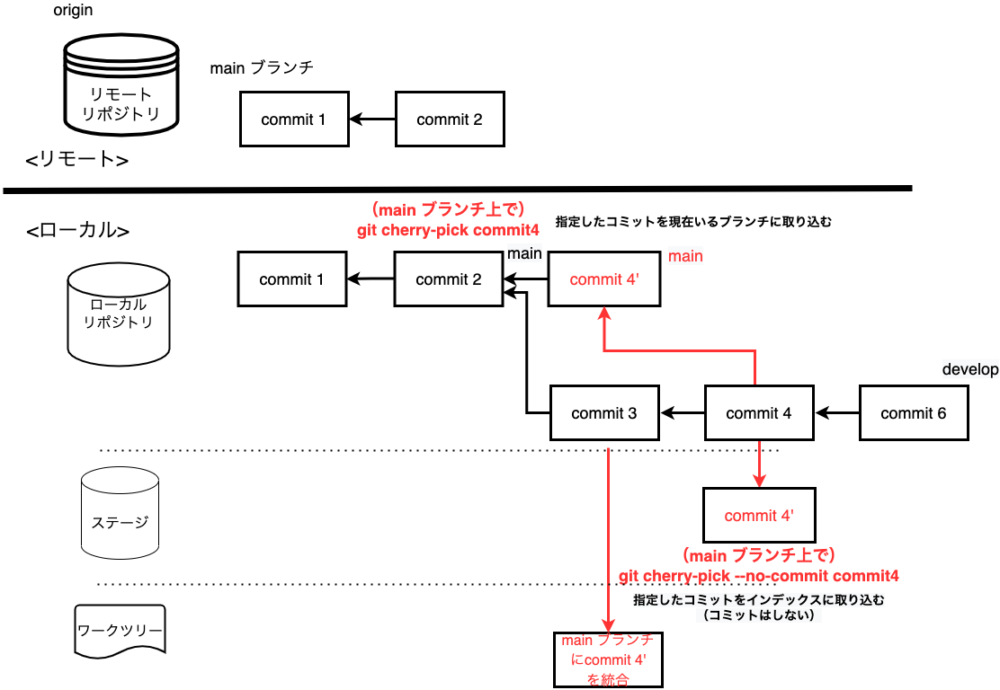

# Git 勉強会 3 日目 <!-- omit in toc -->

基本コマンド ＆ ハンズオン ② 　〜チーム開発編〜
2022/03/28

---

### ここまでのまとめ：リポジトリの構成（1 日目）


---

### ここまでのまとめ：ブランチ・HEAD の実態（1 日目）


---

### ここまでのまとめ：Git コマンド 〜個人開発編〜（2 日目）

- [clone ★](#clone-)
- [config ★](#config-)
- [init](#init)
- [remote](#remote)
- [branch ★](#branch-)
- [switch (checkout) ★](#switch-checkout-)
- [status ★](#status-)
- [add ★](#add-)
- [commit ★](#commit-)
- [push ★](#push-)
- [mv](#mv)
- [rm](#rm)
- [log ★](#log-)
- [diff](#diff)

---

## クイズ

Q. 次のユースケースではどんなコマンドを実行すればいいでしょうか？

1. 新しいブランチ feature を作成し、そのまま移動したい
2. git merge を実行したらコンフリクトしてしまった。状況を確認し、次に取るべき行動の選択肢を知りたい
3. 変更した内容を記録（コミット）したい。同時にコミットメッセージも付けたい
4. 直前のコミットメッセージを修正したい（やや難）

---

## クイズ（解答例） <!-- omit in toc -->

Q. 次のユースケースではどんなコマンドを実行すればいいでしょうか？

```bash
# 1. 新しいブランチを作成し、そのまま移動したい
$ git switch -c feature # git checkout -b feature でも可

# 2. git merge を実行したらコンフリクトしてしまった。状況を確認し、次に取るべき行動の選択肢を知りたい
$ git status

# 3. 変更した内容を記録（コミット）したい。同時にコミットメッセージも付けたい
$ git commit -m "任意のメッセージ"

# 4. 直前のコミットメッセージを修正したい（やや難）
$ git commit --amend -m "修正後のメッセージ"
```

---

## 本日のゴール <!-- omit in toc -->

### 頭の中に「こんなときはこうする」というインデックスをぼんやりと作ること <!-- omit in toc -->

- Git の各サブコマンドの存在を知ること
- 各サブコマンドのユースケースを知り、Git で躓いたときに本資料を見返そうと思い付けること

**→ この資料は辞書として使っていってほしいので、完全に理解しようとしないで OK です！**

---

- [クイズ](#クイズ)
- [復習&予習タイム　〜今日のコマンドをより理解するために〜](#復習予習タイム今日のコマンドをより理解するために)
  - [クイズ：origin develop と origin/develop の違い](#クイズorigin-develop-と-origindevelop-の違い)
  - [復習：origin（リモートリポジトリ）と origin/develop（リモート追跡ブランチ）](#復習originリモートリポジトリと-origindevelopリモート追跡ブランチ)
  - [復習：pull と fetch + merge の違い](#復習pull-と-fetch--merge-の違い)
  - [ブランチとは](#ブランチとは)
  - [マージとは](#マージとは)
  - [手を動かしてイメージを掴んでみよう （Learn Git Branching にチャレンジ）](#手を動かしてイメージを掴んでみよう-learn-git-branching-にチャレンジ)
- [コマンド説明（★ 付きコマンドのみ当日説明します）](#コマンド説明-付きコマンドのみ当日説明します)
  - [pull ★](#pull-)
  - [fetch ★](#fetch-)
    - [主なオプション](#主なオプション)
  - [merge ★](#merge-)
  - [rebase ★](#rebase-)
  - [コラム：merge と rebase の違い](#コラムmerge-と-rebase-の違い)
  - [コラム：merge と rebase はどっちがいい？](#コラムmerge-と-rebase-はどっちがいい)
  - [コラム：Fast-forward merge と Non Fast-forward merge](#コラムfast-forward-merge-と-non-fast-forward-merge)
  - [stash ★](#stash-)
  - [restore (checkout) ★](#restore-checkout-)
  - [reset ★](#reset-)
  - [revert ★](#revert-)
  - [コラム：reset と revert の違い](#コラムreset-と-revert-の違い)
  - [コラム：reset と revert はどっちがいい？](#コラムreset-と-revert-はどっちがいい)
    - [参考](#参考)
  - [cherry-pick ★](#cherry-pick-)
  - [blame](#blame)
  - [tag](#tag)
  - [reflog](#reflog)
- [ハンズオン](#ハンズオン)
  - [ハンズオン ⑥：リモートリポジトリの内容を取得し、現在のブランチに取り込む](#ハンズオン-リモートリポジトリの内容を取得し現在のブランチに取り込む)
  - [ハンズオン ⑦：トピックブランチを作成してローカル内でマージ](#ハンズオン-トピックブランチを作成してローカル内でマージ)
  - [ハンズオン ⑧：ローカルの変更内容を一時退避](#ハンズオン-ローカルの変更内容を一時退避)
  - [ハンズオン ⑨：ローカルで誤ってコミットした内容を元に戻す](#ハンズオン-ローカルで誤ってコミットした内容を元に戻す)
  - [ハンズオン ⑨：ローカルで誤ってコミットした内容を元に戻す（応用編）](#ハンズオン-ローカルで誤ってコミットした内容を元に戻す応用編)
  - [ハンズオン ⑩：別ブランチの特定のコミットを取り込む](#ハンズオン-別ブランチの特定のコミットを取り込む)
- [次回](#次回)

---

## 3 日目アジェンダ（今日はこっち） <!-- omit in toc -->

- Git 基本コマンド ② 〜チーム開発編〜
  - fetch ★
  - merge ★
  - rebase ★
  - pull ★
  - stash ★
  - restore (checkout) ★
  - reset ★
  - revert ★
  - cherry-pick ★
  - blame
  - tag
  - reflog

---

## 復習&予習タイム　〜今日のコマンドをより理解するために〜

- origin develop と origin/develop の違い
- pull と fetch + merge の違い
- ブランチとは

#### 参考記事： <!-- omit in toc -->

- [git pull と git pull –rebase の違いって？図を交えて説明します！](https://kray.jp/blog/git-pull-rebase/) **★ とても分かりやすいのでおすすめ**
- [Git で「追跡ブランチ」って言うのやめましょう - Qiita](https://qiita.com/uasi/items/69368c17c79e99aaddbf)
- [origin master と origin/master の違い - Qiita](https://qiita.com/bitarx/items/4558f86e43a2c3493fa9)

---

### クイズ：origin develop と origin/develop の違い

以下のコマンドで指定している対象ブランチ、何が違うか分かりますか？

#### ケース 1. fetch + merge で指定する対象ブランチ <!-- omit in toc -->

```bash
$ git fetch origin develop  # fetch では origin develop を指定してるけど
$ git merge origin/develop  # merge では origin/develop を指定している・・・？
```

#### ケース 2. merge で指定する対象ブランチ <!-- omit in toc -->

```bash
$ git merge origin/develop  # このコマンドと
```

```bash
$ git merge develop # このコマンドの意味の違いは・・・？
```

**違い分かりますか？**

---

### 復習：origin（リモートリポジトリ）と origin/develop（リモート追跡ブランチ）


---

### クイズ：origin develop と origin/develop の違い（解答） <!-- omit in toc -->

#### origin develop <!-- omit in toc -->

- **origin という名前で管理しているリモートリポジトリの develop ブランチ**

#### origin/develop <!-- omit in toc -->

- **リモートリポジトリ origin の develop ブランチを追跡する、ローカルリポジトリ内にあるリモート追跡ブランチ**

---

### 復習：pull と fetch + merge の違い


---

### ブランチとは

- コミット履歴を分岐する機能。1 つのプロジェクトからブランチを分岐させることにより、プロジェクト本体に影響を与えずに複数機能を安全に並行開発することが可能となる

#### ブランチの実態 <!-- omit in toc -->

- 「コミットを指すポインタ」のこと。ただ単に特定のコミット ID を指差しているだけ


---

### マージとは

- 分岐したコミット履歴を統合する機能

#### マージの種類 <!-- omit in toc -->

統合の手段には merge と rebase がある（後述）


---

### 手を動かしてイメージを掴んでみよう （Learn Git Branching にチャレンジ）

ブランチの枝分かれ・統合やコミットの動きをイメージするため、以下をみんなでやってみましょう！

- [Learn Git Branching](https://learngitbranching.js.org/?locale=ja)
  - 「1: Git のコミット」の 1~4 までみんなでやりましょう

ここでは、下記の種類の git コマンドを学ぶことができます。

- commit
- branch
- checkout (switch)
- merge
- rebase

---

## コマンド説明（★ 付きコマンドのみ当日説明します）

---

### pull ★

#### 機能 <!-- omit in toc -->

- リモートリポジトリの内容を取得し、現在のブランチに取り込む（`git fetch` + `git merge`）

#### ユースケース <!-- omit in toc -->

- リモートリポジトリの最新情報をローカルリポジトリに取り込みたい

---

#### イメージ <!-- omit in toc -->


---

#### 主なオプション <!-- omit in toc -->

- `-r | --rebase`: フェッチ後に現在のブランチを上流ブランチの上にリベース
  - `git fetch` + `git rebase`

#### コマンド例 <!-- omit in toc -->

```bash
$ git switch <ブランチ名> # まず pull したいブランチへ切り替える
$ git pull origin <ブランチ名> # リモートリポジトリの内容を取得してマージ。上流ブランチを設定している場合は git pull で OK
$ git pull -r origin <ブランチ名> # リモートリポジトリの内容を取得してリベース。
```

#### 参考 <!-- omit in toc -->

- [git-pull – Git コマンドリファレンス（日本語版）](https://tracpath.com/docs/git-pull/)
- [git pull コマンドの使い方と、主要オプションまとめ](https://www-creators.com/archives/2295)
- [【初心者向け】git fetch、git merge、git pull の違いについて - Qiita](https://qiita.com/wann/items/688bc17460a457104d7d)
- [git pull と git pull –rebase の違いって？図を交えて説明します！](https://kray.jp/blog/git-pull-rebase/)
- [Git のコミットメッセージを後から変更する方法をわかりやすく書いてみた](https://www.granfairs.com/blog/staff/git-commit-fix)

---

### fetch ★

#### 機能 <!-- omit in toc -->

- リモートリポジトリの内容を取得する
  - 取得した内容はローカルのリモート追跡ブランチに反映するが、ワークツリーには反映しない

#### ユースケース <!-- omit in toc -->

- 他者が作成したブランチに切り替えたいので、リモートリポジトリの最新状態を取得したい
- pull だとワークツリーまで更新してしまうので、とりあえずリモートの状態を確認したい

---

#### イメージ <!-- omit in toc -->


---

#### 主なオプション

- `-p | --prune`: リモートリポジトリで削除されたブランチをローカルリポジトリのリモート追跡ブランチに反映
  - 常に `--prune` を有効にする場合は `git config --global fetch.prune true` を実行して設定を更新
- `--all`: すべてのリモートリポジトリの内容を取得
  - リモートリポジトリが origin しかない場合は使うことはない

#### コマンド例 <!-- omit in toc -->

```bash
$ git fetch # リモートリポジトリの内容をローカルのリモート追跡ブランチに反映
$ git fetch --prune # リモートリポジトリで削除されたブランチをローカルリポジトリに反映
```

#### 参考 <!-- omit in toc -->

- [git-fetch – Git コマンドリファレンス（日本語版）](https://tracpath.com/docs/git-fetch/)
- [git pull と git pull –rebase の違いって？図を交えて説明します！](https://kray.jp/blog/git-pull-rebase/)
- [Git で「追跡ブランチ」って言うのやめましょう - Qiita](https://qiita.com/uasi/items/69368c17c79e99aaddbf)
- [リモートで消されたブランチが手元で残ってしまう件を解消する - Qiita](https://qiita.com/yuichielectric/items/84cd61915a1236f19221)
- [git pull のとき常に prune するための設定 - Qiita](https://qiita.com/suin/items/27a559ab678bc054747e)

---

### merge ★

#### 機能 <!-- omit in toc -->

- 他のブランチやコミットの内容を現在のブランチに取り込む

#### ユースケース <!-- omit in toc -->

- 2 つのブランチを 1 つに統合したい。どのブランチでどんな変更があったかという記録はコミット履歴に残したい
- fetch した内容をワークツリーに反映したい。どのブランチでどんな変更があったかという記録はコミット履歴に残したい
- マージ時にコンフリクトしたので、競合を解決したい

---

#### イメージ （1. リモート追跡ブランチをマージ） <!-- omit in toc -->


---

#### イメージ （2. ブランチをマージ） <!-- omit in toc -->

.drawio.png>)

---

#### 主なオプション <!-- omit in toc -->

- `--no-ff`: fast-forward merge が発生する条件であっても必ずマージコミットを作成
- `--continue`: コンフリクト解決後、マージを続行
- `--abort`: コンフリクト解決を中止し、マージ前の状態に再構築

#### コマンド例 <!-- omit in toc -->

```bash
$ git switch <マージ先のブランチ名> # マージ先のブランチに移動
$ git merge <マージ元のブランチ名>  # 指定したブランチを現在いるブランチに取り込み
$ git merge --no-ff <マージ元のブランチ名>  # fast-forward merge が発生する条件であっても必ずマージコミットを作成
```

#### 参考 <!-- omit in toc -->

- [git-merge – Git コマンドリファレンス（日本語版）](https://tracpath.com/docs/git-merge/)
- [git pull と git pull –rebase の違いって？図を交えて説明します！](https://kray.jp/blog/git-pull-rebase/)
- [git の merge --no-ff のススメ](https://qiita.com/nog/items/c79469afbf3e632f10a1)

---

### rebase ★

#### 機能 <!-- omit in toc -->

- コミットを再適用する（ブランチの分岐点を変更したり、コミットの順番を入れ替えたりできる）
  - re（変える） + base（基点）＝コミットの基点を付け変える

#### ユースケース <!-- omit in toc -->

- 2 つのブランチを 1 つに統合したい。コミットログはきれいに（一直線に）保ちたい（マージコミットを作りたくない）
- fetch した内容をワークツリーに反映したい。コミットログはきれいに（一直線に）保ちたい
- リベース時にコンフリクトしたので、競合を解決したい
- 過去のコミットを編集したい
  - 複数のコミットをひとつにまとめたい
  - 2 つ以上前のコミットを修正したい

---

#### イメージ <!-- omit in toc -->


---

#### 主なオプション <!-- omit in toc -->

- `--continue`: コンフリクト解決後、リベースを続行
- `--abort`: コンフリクト解決を中止し、リベース前の状態に再構築
- `-i | --interactive`: 対話モードで過去のコミットを編集（コミットメッセージの修正やコミットの統合など）

#### コマンド例 <!-- omit in toc -->

```bash
$ git switch <付け替えたいのブランチ名>
$ git rebase <マージ元のブランチ名> # 指定したブランチに対して現在いるブランチで行った全てのコミットを適用
$ git rebase -i HEAD~4  # 最新から 4 つ分のコミットを修正・統合
```

#### 参考 <!-- omit in toc -->

- [git-rebase – Git コマンドリファレンス（日本語版）](https://tracpath.com/docs/git-rebase/)
- [git pull と git pull –rebase の違いって？図を交えて説明します！](https://kray.jp/blog/git-pull-rebase/)
- [git rebase を初めて使った際のまとめ - Qiita](https://qiita.com/310ma3/items/e0ec74b47c6c219f2a8b)
- [rebase -i でコミットをまとめる - Qiita](https://qiita.com/takke/items/3400b55becfd72769214)
- [【やっとわかった！】git の HEAD^と HEAD~の違い - Qiita](https://qiita.com/chihiro/items/d551c14cb9764454e0b9)
- [git rebase 失敗した時の対処法 - Qiita](https://qiita.com/shuntaro_tamura/items/c505b76c1021a35ca9ff)

---

### コラム：merge と rebase の違い


#### イメージ <!-- omit in toc -->

- merge: 現在のブランチの上に他のブランチの内容を取り込む
- rebase: 取り込みたいブランチの上に今のブランチの内容を乗せる

---

### コラム：merge と rebase はどっちがいい？

**A. 慣れないうちは merge の方が無難。あとはチームの運用方針次第。**

- | **merge**      | **rebase**                                                                                                                                                           |
  | -------------- | -------------------------------------------------------------------------------------------------------------------------------------------------------------------- | --------------------------------------------------------------------------------------------------------------------------------------------------------------------------------------------------------------------------------------------------------------------------- |
  | **メリット**   | - どのブランチからどんなコミットを取り込んだのか履歴を追える（merge no-ff を強制する運用の場合） <br> - PR レビューの文脈が残る（// TODO: スカッシュ時はどうか確認） | - 履歴を一直線に保つことができる                                                                                                                                                                                                                                            |
  | **デメリット** | - マージコミットがあると履歴が見づらい <br> (`git log --no-merges` でマージコミットを除いて履歴表示すれば解決？)                                                     | - リモートに push 済の変更を rebase した場合は force-push が必須 <br> - コミッター・コミット ID が変わってしまう <br> - コンフリクトの解決が煩雑（コミットを 1 つずつ適用し、それぞれで解決が必要なため。小さい単位でコンフリクト解決する方が分かりやすいという意見もある） |

#### 参考 <!-- omit in toc -->

- [あなたは merge 派？rebase 派？綺麗な Git ログで実感したメリット](https://style.biglobe.co.jp/entry/2022/03/22/090000) （[記事に対する @kazuho さんのコメント](https://twitter.com/kazuho/status/1506216632103841792?s=21)）
- [Git の rebase と merge の挙動の違いを GitHub を用いて検証してみた - Qiita](https://qiita.com/minakawa-daiki/items/c8a939b5d529ee39eac1)
- [Github での Web 上からのマージの仕方 3 種とその使いどころ - Qiita](https://qiita.com/ko-he-8/items/94e872f2154829c868df)
- [なぜ git rebase をやめるべきか](https://frasco.io/why-you-should-stop-using-git-rebase-535fa30d7e25)
- [【Git】将来の自分を救うのは、rebase だと僕は思うよ](https://blog.dalt.me/2883)

---

### コラム：Fast-forward merge と Non Fast-forward merge

#### Fast-forward merge <!-- omit in toc -->

- 早送りマージ
- **「マージされるブランチがマージの基点にいるとき」** に発生する
- Git はマージ作業を省略し、マージされるブランチのポインタをマージするブランチに移動するだけとなる
  - つまり、マージする際に新しいコミット(=マージコミット)を作成しない
- メリットは、**絶対にコンフリクトが起きない**（マージ作業をしていないので）
- デメリットとして、**「ブランチをマージした」という履歴が残らない。** （マージを間違えて元に戻すときに苦労する）
- `git merge --no-ff` オプションを付けると Fast-forward が発生する条件でも Non Fast-forward となる
  - （オプション付け忘れ防止のため `git config --global --add merge.ff false` と設定するといい）


（[Git の rebase と merge の挙動の違いを GitHub を用いて検証してみた - Qiita](https://qiita.com/minakawa-daiki/items/c8a939b5d529ee39eac1) より引用）

---

#### Non Fast-forward merge <!-- omit in toc -->

- 早送りじゃないマージ（マージコミットを作成）
- **「マージされるブランチがマージの基点にいないとき（既に枝分かれしているとき）」** に発生する
- **「どのブランチからどんな変更（どのコミット）をマージしたか」をコミット履歴として持つ**
- 間違えて意図せぬブランチをマージしてしまった場合、マージコミットを取り消すだけで戻せる
- マージ対象のそれぞれのコミットで同じ箇所の修正がなければ Auto merge, あれば Conflict となる


（[Git の rebase と merge の挙動の違いを GitHub を用いて検証してみた - Qiita](https://qiita.com/minakawa-daiki/items/c8a939b5d529ee39eac1) より引用）

#### 参考 <!-- omit in toc -->

- [3.2 Git のブランチ機能 - ブランチとマージの基本](https://git-scm.com/book/ja/v2/Git-%E3%81%AE%E3%83%96%E3%83%A9%E3%83%B3%E3%83%81%E6%A9%9F%E8%83%BD-%E3%83%96%E3%83%A9%E3%83%B3%E3%83%81%E3%81%A8%E3%83%9E%E3%83%BC%E3%82%B8%E3%81%AE%E5%9F%BA%E6%9C%AC)
- [git merge の動作仕様と、主要オプションのまとめ](https://www-creators.com/archives/4996)
- [Git の rebase と merge の挙動の違いを GitHub を用いて検証してみた - Qiita](https://qiita.com/minakawa-daiki/items/c8a939b5d529ee39eac1)
- [こわくない Git](https://www.slideshare.net/kotas/git-15276118)

---

### stash ★

#### 機能 <!-- omit in toc -->

- 未コミットの変更を退避する

#### ユースケース <!-- omit in toc -->

- 他ブランチに切り替えたいが、作業が中途半端なのでコミットはしたくない

---

#### イメージ <!-- omit in toc -->


---

#### 主なオプション <!-- omit in toc -->

- `-u | --include-untracked`: 追跡対象に含まれていないファイル（新規作成ファイルなど）も含めて退避

#### コマンド例 <!-- omit in toc -->

```bash
$ git stash -u  # 新規作成ファイルも含めて変更を退避
$ git stash push -m "<メッセージ>" -u  # メッセージを付けて変更を退避
$ git stash list  # 退避した作業の一覧を見る
$ git stash pop # 直前に退避した変更を戻す。退避していたデータは削除する。
$ git stash apply stash@{N} # 直前の次から数えてN番目に退避した変更を戻す。直前の変更は N=0。stash@{N} を省略した場合は直前に stash した情報（N=0）を戻す
$ git stash show stash@{N} -p # 直前の次から数えてN番目に退避した変更の詳細を見る。
$ git stash drop stash@{N} # 直前の次から数えてN番目に退避していたデータを削除する
```

#### 参考 <!-- omit in toc -->

- [git-stash Documentation](https://git-scm.com/docs/git-stash)
- [【git stash】コミットはせずに変更を退避したいとき - Qiita](https://qiita.com/chihiro/items/f373873d5c2dfbd03250)

---

### restore (checkout) ★

#### 機能 <!-- omit in toc -->

- ファイルを指定した状態に復元する

#### ユースケース <!-- omit in toc -->

- add をしたけど取り消したい
- 特定のコミットの時点に戻したい

---

#### イメージ <!-- omit in toc -->



---

#### 主なオプション <!-- omit in toc -->

- `-S | --staged`: インデックスを復元
- `-s | --source`: 指定したコミットの状態にワークツリーファイルを復元（reset と異なりコミットは取り消されない）

#### コマンド例 <!-- omit in toc -->

```bash
git restore <ファイル名>  # 特定のファイルを保存前に戻す。破壊的操作。git checkout -- <ファイル名> と同じ
git restore --staged . # 対象ファイル全体を add される前に戻す。git reset . と同じ
git restore --source <コミットID> <ファイル名>  # 特定のファイルを特定のコミット時点に戻す。git checkout <コミットID> -- <ファイル名> と同じ
git restore --source HEAD~2 .  # 対象ファイル全体を2つ前のコミット時点の状態に復元する
```

#### 備考 <!-- omit in toc -->

- restore は Git バージョン 2.23.0 でリリース (2019/08/16)
- checkout は複数の役割を兼ね備えてしまっているため、こちらの方が直感的に理解しやすい

#### 参考 <!-- omit in toc -->

- [git-restore – Git コマンドリファレンス（日本語版）](https://tracpath.com/docs/git-restore/)
- [git switch と restore の役割と機能について - Qiita](https://qiita.com/yukibear/items/4f88a5c0e4b1801ee952)
- [これからは git restore を使ってみようかな](https://bufferings.hatenablog.com/entry/2020/05/01/013451)

---

### reset ★

#### 機能 <!-- omit in toc -->

- 指定したファイルを特定のコミットの状態まで戻す
  - 実際の挙動としては HEAD の位置を変更することで、特定のコミット時点の状態へと移動している
  - オプションによってインデックス、ワークツリーの内容も変更できる

#### ユースケース <!-- omit in toc -->

- 直前のコミットを取り消したい **（push する前）**
- 目的のブランチに切り替える前に誤って pull してしまったのを取り消したい

---

#### イメージ <!-- omit in toc -->


---

#### 主なオプション <!-- omit in toc -->

- `--soft`: インデックスとワークツリーはそのままで、指定したコミットの状態へリセット **（commit のみ取り消し）**
- `--mixed`: ワークツリーはそのままで、インデックスを指定したコミットの状態へリセット **（commit と add を取り消し。デフォルト）**
- `--hard`: インデックスとワークツリーを指定したコミットの状態へリセット **（現在のファイル変更も含めて取り消し）**

#### コマンド例 <!-- omit in toc -->

```bash
$ git reset --soft HEAD^  # 直前の commit のみ取り消す。現在のファイル変更はそのまま。HEAD^ は直前のコミットを意味する
$ git reset --mixed HEAD^  # 直前の commit, add を取り消す。現在のファイル変更はそのまま。
$ git reset --hard HEAD^  # 直前の commit, add, 現在のファイル変更も全部取り消す（破壊的操作）
$ git reset --hard <コミットID> # 指定したコミットの状態に戻す
$ git reset --hard <ブランチ>  # 指定したブランチの状態に戻す（現在いるブランチに戻す場合は下と同じ）
$ git reset --hard ORIG_HEAD  # 直前の reset を取り消す（最新の状態に戻る）
```

#### 備考 <!-- omit in toc -->

- `ORIG_HEAD`: HEAD が移動するコマンドを実行した際に、コマンド実行時の HEAD の位置を記録しているポインタ

#### 参考 <!-- omit in toc -->

- [git-reset – Git コマンドリファレンス（日本語版）](https://tracpath.com/docs/git-reset/)
- [[git reset (--hard/--soft)]ワークツリー、インデックス、HEAD を使いこなす方法](https://qiita.com/shuntaro_tamura/items/db1aef9cf9d78db50ffe)
- [第 6 話 git reset 3 種類をどこよりもわかりやすい図解で解説！【連載】マンガでわかる Git ～コマンド編～](https://www.r-staffing.co.jp/engineer/entry/20191129_1)
- [git reset についてもまとめてみる](https://murank.hatenadiary.org/entry/20110327/1301224770)

---

### revert ★

#### 機能 <!-- omit in toc -->

- 指定したコミットの内容を打ち消すコミットを生成し、現在いるブランチに適用する

#### ユースケース <!-- omit in toc -->

- 直前のコミットを取り消したい **（push した後）**

---

#### イメージ <!-- omit in toc -->


---

#### 主なオプション <!-- omit in toc -->

- `-e | --edit`: コミットメッセージを編集する **（デフォルト）**
- `--no-edit`: コミットメッセージを編集しない
- `-n | --no-commit`: 打ち消しコミットを生成するが、適用しない
- `-m | --mainline`: マージコミットを打ち消す場合
  - オプションの引数に 1 か 2 を指定する。1 が「マージされた側のブランチ」、2 が「マージする側のブランチ」
  - マージしたコミットそのものを revert するときは 1 になるので、基本的に 1 を使う
- `--continue`: コンフリクト解決後、マージを続行
- `--abort`: コンフリクト解決を中止し、マージ前の状態に再構築

#### コマンド例 <!-- omit in toc -->

```bash
$ git revert HEAD # 直前のコミットを打ち消すコミットを生成し、適用
$ git revert -n <コミットID> # 特定のコミットを打ち消すコミットを生成（適用はしない。適用するときは git commit）
$ git revert HEAD~N  # 直前からN個前の範囲で複数コミットを打ち消すコミットを生成し、適用
$ git revert <コミットID A>..<コミットID B>  # A から B の範囲で複数コミットを打ち消すコミットを生成し、適用
$ $ git revert -m 1 <マージコミットID>  # マージコミットを打ち消し。1が「マージされた側のブランチ」、2が「マージする側のブランチ」。
```

#### 参考 <!-- omit in toc -->

- [git-revert Documentation](https://git-scm.com/docs/git-revert)
- [【git コマンド】いまさらの revert - Qiita](https://qiita.com/chihiro/items/2fa827d0eac98109e7ee)
- [Git revert と reset について - Qiita](https://qiita.com/Sammy_U/items/e37c7242544fd1da81be)

---

### コラム：reset と revert の違い


#### イメージ <!-- omit in toc -->

- reset: **指定したコミットの状態に戻す**（指定したコミットより新しいコミットは削除する）
  - 直前のコミットに戻りたい場合は、1 つ前のコミット（`HEAD^`）を指定する
  - `$ git reset HEAD^ `
- revert: **指定したコミットを打ち消すコミットを生成する**
  - 直前のコミットに戻りたい場合は、現在のコミット（`HEAD`）を打ち消すように指定する
  - `$ git revert HEAD`

---

### コラム：reset と revert はどっちがいい？

**A. リモートリポジトリに push 済（他者に共有済）であれば revert。あとはチームの運用方針次第。**

- | **reset**      | **revert**                                                                                                                                                                               |
  | -------------- | ---------------------------------------------------------------------------------------------------------------------------------------------------------------------------------------- | ---------------------------------------------------------------------------------------------------------------------------------------------------------- |
  | **メリット**   | - 誤ったコミット自体を削除できるのでコミット履歴が見やすい <br> - HEAD の位置を大幅に移動することができる                                                                                | - コミット自体を削除するわけではないので、安全にコミットを元に戻すことができる <br> - 誤った履歴が残ることで revert 自体の取り消しも容易に行うことができる |
  | **デメリット** | - チームで開発にて他の人が同じブランチで作業していた場合に、コンフリクトがおきたり、エラー発生の原因となる可能性がある <br> - コミット自体を削除してしまうため、復元作業に少し手間がかる | - 誤った履歴が残ってしまうので、コミットログが見づらくなる <br> - 直前のコミットより前のコミットを revert する場合、コミットの整合性が取れなくなる         |

#### 参考

- [Git revert と reset について - Qiita](https://qiita.com/Sammy_U/items/e37c7242544fd1da81be)

---

### cherry-pick ★

#### 機能 <!-- omit in toc -->

- 指定したコミットの内容を現在いるブランチに取り込む

#### ユースケース <!-- omit in toc -->

- 他のブランチの特定のコミットを現在のブランチに取り込みたい
  - 特定のバージョンで開発した機能を他のバージョンにも適用（出荷）したい
  - 複数ブランチを並行して開発している状況で、あるブランチがマージされたので、最新の統合ブランチから新たにトピックブランチを切り、先行して開発が進んでいる他のブランチから必要なコミットのみを取ってきたい

---

#### イメージ <!-- omit in toc -->



---

#### 主なオプション <!-- omit in toc -->

- `-e | --edit`: コミットメッセージを編集する
- `-n | --no-commit`: 指定したコミットを取得するが、適用しない
- `--continue`: コンフリクト解決後、マージを続行
- `--abort`: コンフリクト解決を中止し、マージ前の状態に再構築

#### コマンド例 <!-- omit in toc -->

```bash
$ git cherry-pick <コミットID>  # 特定のコミットを現在のブランチに取り込み、適用
$ git cherry-pick -n <コミットID>  # 特定のコミットをインデックスに取り込む（適用するときは git commit）
$ git cherry-pick <コミットID A> <コミットID B>  # AとBのコミットを現在のブランチに取り込み、適用
$ git cherry-pick <コミットID A>..<コミットID B>  # AからBの範囲のコミットを現在のブランチに取り込み、適用
```

#### 参考 <!-- omit in toc -->

- [git-cherry-pick Documentation](https://git-scm.com/docs/git-cherry-pick)
- [git cherry-pick を完全マスター!特定コミットのみを取り込む方法](https://www.sejuku.net/blog/71544)
- [git で他ブランチの特定のコミットを取り込む方法 - Qiita](https://qiita.com/Rock22/items/e53d6135c59099149592)

---

### blame

#### 機能 <!-- omit in toc -->

- 指定されたファイルの各行に最終更新者・日時などの情報を表示する

#### ユースケース <!-- omit in toc -->

- この行は誰が変更したのか調べたい

---

#### 主なオプション <!-- omit in toc -->

- `-L`: 最終コミットを表示する行の範囲を指定

#### コマンド例 <!-- omit in toc -->

```bash
$ git blame <ファイル名>  # 特定のファイルについて各行ごとに最終コミット情報を表示する
$ git blame -L 40,50 <ファイル名> # 40〜50行目の最終コミット情報を表示する
$ git blame -L 40,+10 <ファイル名> # 40行目から10行分の最終コミット情報を表示する
```

#### 備考 <!-- omit in toc -->

- 最近のエディタでは拡張機能を入れると blame の結果が表示される（Visual Studio Code では [GitLens](https://marketplace.visualstudio.com/items?itemName=eamodio.gitlens#current-line-blame-)）

#### 参考 <!-- omit in toc -->

- [git-blame Documentation](https://git-scm.com/docs/git-blame)
- [インデントコミットで真犯人がわからなくなった場合の git blame - Qiita](https://qiita.com/sonots/items/b6852db6638cda233bc8)
- [GitLens — Git supercharged - Visual Studio Marketplace](https://marketplace.visualstudio.com/items?itemName=eamodio.gitlens#current-line-blame-)

---

### tag

#### 機能 <!-- omit in toc -->

- コミットにタグを付ける、削除する、一覧表示する

#### ユースケース <!-- omit in toc -->

- リリースした時点のソースコードに名前を付けたい

---

#### イメージ <!-- omit in toc -->


---

#### 主なオプション <!-- omit in toc -->

- `-a | --annotate`: 注釈付きのタグを作成
- `-m | --message`: メッセージを付与
- `-l | --list`: タグを一覧表示

#### コマンド例 <!-- omit in toc -->

```bash
$ git tag <タグ名>  # コメント（注釈）なしでタグを作成する
$ git tag -a <タグ名> -m '<タグのコメント>' # コメント（注釈）付きでタグを作成
$ git tag -a <タグ名> -m '<タグのコメント>' <コミットID>  # 過去のコミットにタグを作成
$ git push origin <タグ名>  # タグをリモートリポジトリに反映する
$ git tag -l  # タグを一覧表示する
```

#### 参考 <!-- omit in toc -->

- [git-tag – Git コマンドリファレンス（日本語版）](https://tracpath.com/docs/git-tag/)
- [git tag の使い方まとめ - Qiita](https://qiita.com/growsic/items/ed67e03fda5ab7ef9d08)

---

### reflog

#### 機能 <!-- omit in toc -->

- git の操作履歴を表示する
  - 過去に行った branch の移動や commit、pull や reset などの操作履歴を見ることができる

#### ユースケース <!-- omit in toc -->

- コミット履歴だけでなく HEAD やブランチの動きなど細かいところまで確認したい
- 誤って意図と異なるコミットへ `git reset --hard` をしてしまったので戻したい

---

#### 主なオプション <!-- omit in toc -->

- `--date=default`: 操作日時を絶対時刻で表示

#### コマンド例 <!-- omit in toc -->

```bash
# $ git reset --hard を失敗してしまったとき
$ git reflog  # コミット履歴や HEAD・ブランチの参照に関する変化ログを表示
$ git reflog --date=default # 日時付きで表示
$ git reset HEAD@{N} --hard # reflog 確認した元に戻したいコミットを指定し、reset --hard で戻す
```

#### 参考 <!-- omit in toc -->

- [git-reflog Documentation](https://git-scm.com/docs/git-reflog)
- [git reflog についてまとめてみる](https://gist.github.com/kymmt90/9c997726b638b316f9be07aa4e3eea5e)
- [【git reflog】ブランチの復元やリセットしたコミットを元に戻す方法](https://toronavi.com/git-reflog)
- [git reflog を日時で参照する](https://zenn.dev/yoichi/articles/git-refer-reflog-by-datetime)

---

## ハンズオン

### 事前準備 <!-- omit in toc -->

以下が終わっていない人は実施をお願いします。

- ローカル端末 Git（v2.23.0 以上推奨） をインストールしておいてください。（ターミナルで git --version を実行して v2.23.0 以上が表示されれば OK です）
- ハンズオン用に GitHub や GitLab で個人用のリモートリポジトリを作成しておいてください。（社用・私用は問いません）
- 勉強会２日目スライドのハンズオン ①（git clone）を完了させておいてください。
- 勉強会２日目スライドのハンズオン ②（git config）を完了させておいてください。

**利用するコマンドの説明スライドを復習しながら進めましょう！**

---

### ハンズオン ⑥：リモートリポジトリの内容を取得し、現在のブランチに取り込む

リモートリポジトリの内容を取得し、現在チェックアウトしているブランチに取り込んでみましょう。
pull でもできますが、今回は fetch + merge を使ってやってみましょう。
（次頁に解答例があります）

#### 事前準備 <!-- omit in toc -->

1. GitHub/GitLab で事前準備したハンズオン用リポジトリをブラウザで表示
2. 自分がどのブランチのコードを開いているかを確認（ハンズオンでは main を例にします）
3. ファイル index.html を作成してコミット（中身は `<h1>Git Exercise</h1>` を書く）
   1. "Add file", もしくは "+" ボタンをクリックして追加
   2. "Edit file" でファイル内本文に `<h1>Git Exercise</h1>` を追記
   3. コミットメッセージに "Add index.html" と記載してコミット

#### 操作手順例 <!-- omit in toc -->

1. ハンズオン用ディレクトリへ移動
2. リモートの変更内容を取得したいブランチへ切り替え
3. リモートリポジトリの内容をリモート追跡ブランチに反映
4. ローカルブランチとリモート追跡ブランチの差分を確認 （`ヒント： diff <ブランチ名> origin/<ブランチ名>`）
5. リモート追跡ブランチの内容をローカルリポジトリに反映
6. リモートリポジトリから取り込んだコミットとマージコミットがコミット履歴に反映されていることを確認
7. リモートリポジトリの内容がローカルに反映されていることを確認

---

### ハンズオン ⑥：リモートリポジトリの内容を取得し、現在のブランチに取り込む（解答例） <!-- omit in toc -->

```bash
$ cd git-exercise # ハンズオン用ディレクトリへ移動（※ git-exercise は例です）
$ git switch main # リモートの変更内容を取得したいブランチへ切り替え

$ git fetch # リモートリポジトリの内容をリモート追跡ブランチに反映
$ git diff main origin/main # ローカルブランチとリモート追跡ブランチの差分を確認（エディタで vim が開いた場合は `:q` で終了）
$ git merge origin/main # リモート追跡ブランチの内容をローカルリポジトリに反映（エディタで vim が開いた場合は `:x` で保存して終了）
# 上記 fetch + merge の手順は git pull origin main でも可

$ git log # リモートリポジトリから取り込んだコミットとマージコミットがコミット履歴に反映されていることを確認（エディタで vim が開いた場合は `:q` で終了）
$ ls # リモートリポジトリの内容がローカルに反映されていることを確認
```

---

### ハンズオン ⑦：トピックブランチを作成してローカル内でマージ

ローカルリポジトリで統合ブランチ（ex. develop）からトピックブランチ（ex. feature1）を作成し、トピックブランチで適当な修正を行ってコミットしてみましょう。
その後、統合ブランチに戻ってトピックブランチをマージしてみましょう。
（次頁に解答例があります）

#### 操作手順例 <!-- omit in toc -->

1. ハンズオン用ディレクトリへ移動
2. ベースブランチとする develop ブランチへ切り替え（未作成の場合は git switch -c develop で作成）
3. feature1 ブランチを作成して切り替え
4. feature1.html というファイルを作成
5. "<h1>feature1</h1>" という内容を feature1.html に追記
6. 変更内容をインデックスに追加
7. "Add feature1.html" というメッセージを付けてインデックスに追加した内容をコミット
8. ベースブランチへ切り替え
9. ベースブランチと feature1 ブランチの差分を確認 （`ヒント： diff <ブランチ名 A> <ブランチ名 B>`）
10. feature1 ブランチを統合
11. feature1 ブランチでのコミットとマージコミットがコミット履歴に反映されていることを確認
12. feature1 ブランチの内容がベースブランチに反映されていることを確認

---

### ハンズオン ⑦：トピックブランチを作成してローカル内でマージ（解答例） <!-- omit in toc -->

```bash
$ cd git-exercise # ハンズオン用ディレクトリへ移動（※ git-exercise は例です）
$ git switch develop # ベースブランチとする develop ブランチへ切り替え（未作成の場合は git switch -c develop で作成）

$ git switch -c feature1 # feature1 ブランチを作成して切り替え
$ touch feature1.html  # feature1.html というファイルを作成（エディタ上でファイルを新規作成しても OK）
$ echo "<h1>feature1</h1>" >> feature1.html # "<h1>feature1</h1>" という内容を feature1.html に追記（エディタ上で追記しても OK）

$ git add . # 変更内容をインデックスに追加
$ git commit -m "Add feature1.html"  # "Add feature1.html" というメッセージを付けてインデックスに追加した内容をコミット

$ git switch develop  # develop ブランチへ切り替え（※ develop は例です）
$ git diff develop feature1  # develop ブランチと feature1 ブランチの差分を確認
$ git merge feature1 # feature1 ブランチを統合（エディタで vim が開いた場合は `:x` で保存して終了）

$ git log # feature1 ブランチでのコミットとマージコミットがコミット履歴に反映されていることを確認（エディタで vim が開いた場合は `:q` で終了）
$ ls # feature1 ブランチの内容が develop ブランチに反映されていることを確認
```

---

### ハンズオン ⑧：ローカルの変更内容を一時退避

ローカルリポジトリで適当な修正を行った後に変更を一時退避してみましょう （次頁に解答例があります）

#### 操作手順例 <!-- omit in toc -->

1. ハンズオン用ディレクトリへ移動
2. develop ブランチへ切り替え
3. stash-test ブランチを作成して切り替え
4. "<p>stash test</p>" という内容を既存の feature1.html に追記
5. 変更を一時退避
6. stash.html というファイルを作成
7. 新規作成ファイルも含めて変更を一時退避
8. 現在の状態を確認する。 `nothing to commit, working tree clean` となっていることを確認
9. 退避した作業の一覧を確認
10. 直前から 2 番目に退避した変更の詳細を確認（※ 直前の変更は N=0）
11. 直前から 2 番目に退避した変更を復元（※ 直前の変更は N=0）
12. 現在の状態を確認。 `Changes not staged for commit: modified: feature1.html` となっていることを確認
13. feature1.html の内容に "<p>stash test</p>" があることを確認
14. 直前に退避した変更を復元。その際に退避していたデータは削除する
15. ディレクトリ内のファイルを確認
16. 退避した作業の一覧を確認。直前の退避データが削除されていることを確認
17. stash.html を削除

---

### ハンズオン ⑧：ローカルの変更内容を一時退避（解答例） <!-- omit in toc -->

```bash
$ cd git-exercise # ハンズオン用ディレクトリへ移動（※ git-exercise は例です）
$ git switch develop # develop ブランチへ切り替え（※ develop は例です。未作成の場合は git switch -c develop で作成）

$ git switch -c stash-test # stash-test ブランチを作成して切り替え
$ echo "<p>stash test</p>" >> feature1.html # "<p>stash test</p>" という内容を既存の feature1.html に追記（エディタ上で追記しても OK）
$ git stash  # 変更を一時退避

$ touch stash.html  # stash.html というファイルを作成（エディタ上でファイルを新規作成しても OK）
$ git stash -u  # 新規作成ファイルも含めて変更を一時退避
$ git status  # 現在の状態を確認。`nothing to commit, working tree clean` となっていることを確認
$ git stash list  # 退避した作業の一覧を確認

$ git stash show stash@{1} -p # 直前から2番目に退避した変更の詳細を確認（直前の変更は N=0）。"<p>stash test</p>" という差分が表示されている
$ git stash apply stash@{1} # 直前から2番目に退避した変更を復元（直前の変更は N=0）
$ git status  # 現在の状態を確認。`Changes not staged for commit: modified: feature1.html` となっていることを確認
$ cat feature1.html # feature1.html の内容に "<p>stash test</p>" があることを確認

$ git stash pop # 直前に退避した変更を復元。その際に退避していたデータは削除する
$ ls  # ディレクトリ内のファイルを確認。stash.html が作成されていることを確認
$ git stash list  # 退避した作業の一覧を確認。直前の退避データが削除されていることを確認
$ rm stash.html # stash.html を削除（エディタ上でファイルを削除しても OK）
```

---

### ハンズオン ⑨：ローカルで誤ってコミットした内容を元に戻す

ローカルリポジトリで誤ってコミットした内容を元に戻してみましょう （次頁に解答例があります）

#### 操作手順例 <!-- omit in toc -->

1. ハンズオン用ディレクトリへ移動
2. develop ブランチへ切り替え
3. reset-test ブランチを作成して切り替え
4. feature2.html というファイルを作成
5. 変更内容をインデックスに追加
6. "Add feature2.html" というメッセージを付けてインデックスに追加した内容をコミット
7. commit のみ取り消し。現在のファイル変更はそのまま
8. 現在の状態を確認
   1. `Changes to be committed: new file: feature2.html` となっていることを確認
9. "Add feature2.html" というメッセージを付けてインデックスに追加した内容をコミット
10. commit, add, 現在のファイル変更も全部取り消し
11. 現在の状態を確認
    1. `nothing to commit, working tree clean` となっていることを確認

---

### ハンズオン ⑨：ローカルで誤ってコミットした内容を元に戻す（解答例） <!-- omit in toc -->

```bash
$ cd git-exercise # ハンズオン用ディレクトリへ移動（※ git-exercise は例です）
$ git switch develop # develop ブランチへ切り替え（※ develop は例です。未作成の場合は git switch -c develop で作成）

$ git switch -c reset-test # reset-test ブランチを作成して切り替え
$ touch feature2.html  # feature2.html というファイルを作成（エディタ上でファイルを新規作成しても OK）
$ git add . # 変更内容をインデックスに追加
$ git commit -m "Add feature2.html"  # "Add feature2.html" というメッセージを付けてインデックスに追加した内容をコミット
$ git reset --soft HEAD^ # commit のみ取り消し。現在のファイル変更はそのまま。HEAD^ は直前のコミットを意味する
$ git status  # 現在の状態を確認。`Changes to be committed:	new file:   feature2.html` となっていることを確認

$ git commit -m "Add feature2.html"  # "Add feature2.html" というメッセージを付けてインデックスに追加した内容をコミット
$ git reset --hard HEAD^ # commit, add, 現在のファイル変更も全部取り消し（破壊的操作）
$ git status  # 現在の状態を確認。`nothing to commit, working tree clean` となっていることを確認
```

---

### ハンズオン ⑨：ローカルで誤ってコミットした内容を元に戻す（応用編）

ローカルリポジトリで２つ以上前のコミット状態に戻したり、戻す操作自体を取り消したりしてみましょう
（次頁に解答例があります）

#### 操作手順例 <!-- omit in toc -->

（ハンズオン ⑨ の基本編が終わった状態から）

1.  feature2.html というファイルを作成
2.  変更内容をインデックスに追加
3.  "Add feature2.html" というメッセージを付けてインデックスに追加した内容をコミット
4.  feature3.html というファイルを作成
5.  変更内容をインデックスに追加
6.  "Add feature3.html" というメッセージを付けてインデックスに追加した内容をコミット
7.  コミット履歴を確認
    1.  2 つのコミットがコミット履歴に反映されていることを確認
8.  2 つ前のコミットの状態へリセット
9.  コミット履歴を確認
    1.  2 つのコミットがコミット履歴から消えていることを確認
10. 直前の reset を取り消し
11. コミット履歴を確認
    1.  2 つのコミットがコミット履歴に反映されていることを確認
12. develop ブランチの状態へリセット
13. develop ブランチ に切り替え

---

### ハンズオン ⑨：ローカルで誤ってコミットした内容を元に戻す（応用編）（解答例） <!-- omit in toc -->

```bash
# （ハンズオン ⑨ の基本編が終わった状態から）
$ touch feature2.html  # feature2.html というファイルを作成（エディタ上でファイルを新規作成しても OK）
$ git add . # 変更内容をインデックスに追加
$ git commit -m "Add feature2.html"  # "Add feature2.html" というメッセージを付けてインデックスに追加した内容をコミット
$ touch feature3.html  # feature3.html というファイルを作成（エディタ上でファイルを新規作成しても OK）
$ git add . # 変更内容をインデックスに追加
$ git commit -m "Add feature3.html"  # "Add feature3.html" というメッセージを付けてインデックスに追加した内容をコミット
$ git log # コミット履歴を確認。2つのコミットがコミット履歴に反映されていることを確認（エディタで vim が開いた場合は `:q` で終了）

$ git reset --hard HEAD~2 # 2つ前のコミットの状態へリセット
$ git log # コミット履歴を確認。2つのコミットがコミット履歴から消えていることを確認（エディタで vim が開いた場合は `:q` で終了）

$ git reset --hard ORIG_HEAD # 直前の reset を取り消し
$ git log # コミット履歴を確認。2つのコミットがコミット履歴に反映されていることを確認（エディタで vim が開いた場合は `:q` で終了）

$ git reset --hard develop  # develop ブランチの状態へリセット
$ git switch develop  # develop ブランチ に切り替え
```

---

### ハンズオン ⑩：別ブランチの特定のコミットを取り込む

ローカルリポジトリで別ブランチにある特定のコミットを取り込んでみましょう （次頁に解答例があります）

#### 操作手順例 <!-- omit in toc -->

1. ハンズオン用ディレクトリへ移動
2. develop ブランチへ切り替え
3. cherry-test ブランチを作成して切り替え
4. feature4.html というファイルを作成
5. 変更内容をインデックスに追加
6. "Add feature4.html" というメッセージを付けてインデックスに追加した内容をコミット
7. feature5.html というファイルを作成
8. 変更内容をインデックスに追加
9. "Add feature5.html" というメッセージを付けてインデックスに追加した内容をコミット
10. コミット履歴を確認。"Add feature5.html" のコミット ID をコピーして控えおく
11. develop ブランチへ切り替え
12. pick-test ブランチを作成して切り替え
13. "Add feature5.html" のコミットを現在のブランチに取り込み
14. コミット履歴を確認。"Add feature5.html" のコミットが反映されていることを確認
15. ディレクトリ内のファイルを確認。feature5.html が作成されていることを確認

---

### ハンズオン ⑩：別ブランチの特定のコミットを取り込む（解答例） <!-- omit in toc -->

```bash
$ cd git-exercise # ハンズオン用ディレクトリへ移動（※ git-exercise は例です）
$ git switch develop # develop ブランチへ切り替え（※ develop は例です。未作成の場合は git switch -c develop で作成）

$ git switch -c cherry-test # cherry-test ブランチを作成して切り替え
$ touch feature4.html  # feature4.html というファイルを作成（エディタ上でファイルを新規作成しても OK）
$ git add . # 変更内容をインデックスに追加
$ git commit -m "Add feature4.html"  # "Add feature4.html" というメッセージを付けてインデックスに追加した内容をコミット

$ touch feature5.html  # feature5.html というファイルを作成（エディタ上でファイルを新規作成しても OK）
$ git add . # 変更内容をインデックスに追加
$ git commit -m "Add feature5.html"  # "Add feature5.html" というメッセージを付けてインデックスに追加した内容をコミット
$ git log # コミット履歴を確認。"Add feature5.html" のコミットID をコピーして控えおく

$ git switch develop  # develop ブランチへ切り替え
$ git switch -c pick-test # pick-test ブランチを作成して切り替え
$ git cherry-pick <上記で控えたコミットID> # "Add feature5.html" のコミットを現在のブランチに取り込み
$ git log # コミット履歴を確認。"Add feature5.html" のコミットが反映されていることを確認
$ ls # ディレクトリ内のファイルを確認。feature5.html が作成されていることを確認
```

---

## 本日のゴール（再掲） <!-- omit in toc -->

### 頭の中に「こんなときはこうする」というインデックスをぼんやりと作ること <!-- omit in toc -->

- Git の各サブコマンドの存在を知ること
- 各サブコマンドのユースケースを知り、Git で躓いたときに本資料を見返そうと思い付けること

**→ この資料は辞書として使っていってほしいので、完全に理解しようとしないで OK です！**

---

## 次回

次回は **チーム開発体験編** です！
おたのしみに！
